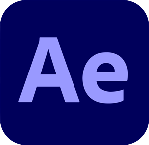
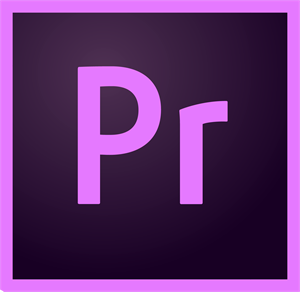
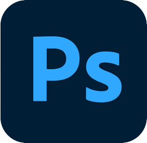

<h1 align="center">
  
</h1>

<h5 align="center">
  <code>
    <a href="https://www.linkedin.com/in/darik-aflah-480b61219/" title="LinkedIn Profile"> LinkedIn</a></code>
  <code><a href="https://dribbble.com/drkflh" title="Dribbble Profile"> Dribbble</a></code>
  <code><a href="https://www.instagram.com/drkflh" title="Instagram Profile"> Instagram</a></code>
</h5>
 

  Hi, I'm Darik Aflah Aufah Arisianto, Beginner To Full Stack Developer - UI/UX Designer
   
  🏫 I'm studying at Telkom Purwokerto Vocational High School
   
  💬 Ask me anything from <a href="https://github.com/drkflh/drkflh/issues" title="Issues">Here</a>
   
  📫 How to reach me: <a href="mailto: darikaflah@gmail.com">darikaflah@gmail.com</a>

<h2 align="center">🔥 Languages & Frameworks & Tools & Abilities</h2>
 

   <code></code>
  <code></code>
  <code></code>
  <code></code>
  <code></code>
  <code></code>
  <code></code>
  <code></code>
  <code></code>
   <code></code>
    <code></code>
  <code></code>
  <code></code>
  <code></code>
  <code></code>
  <code></code>
   <code></code>
    <code></code>
    <code></code>
    <code></code>

